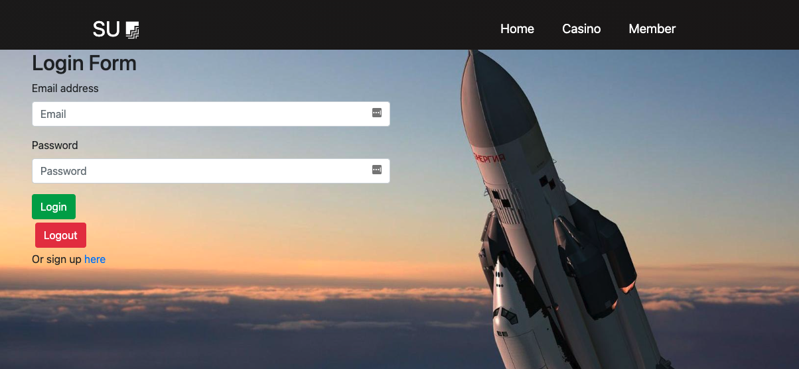
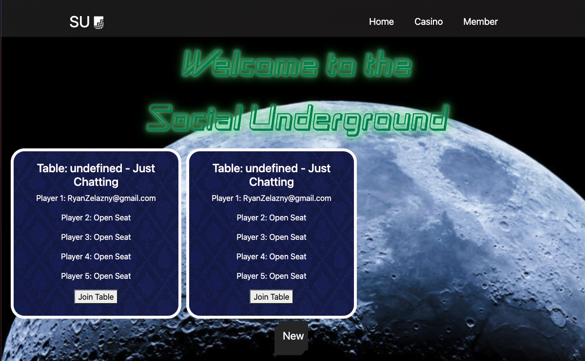
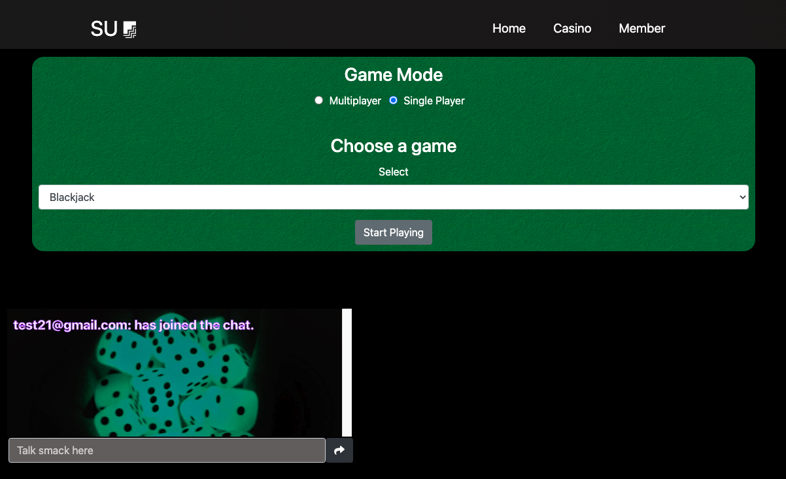
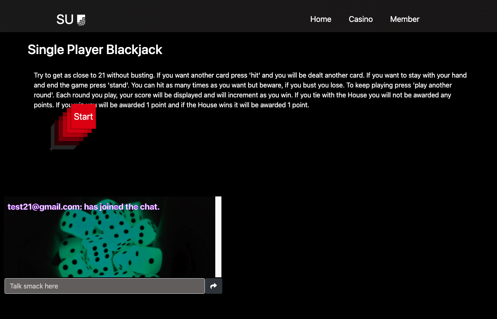
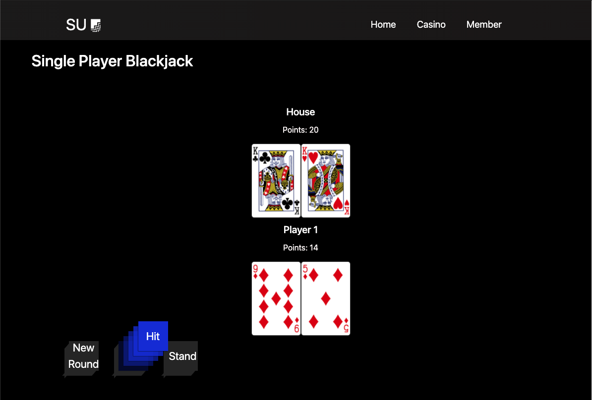
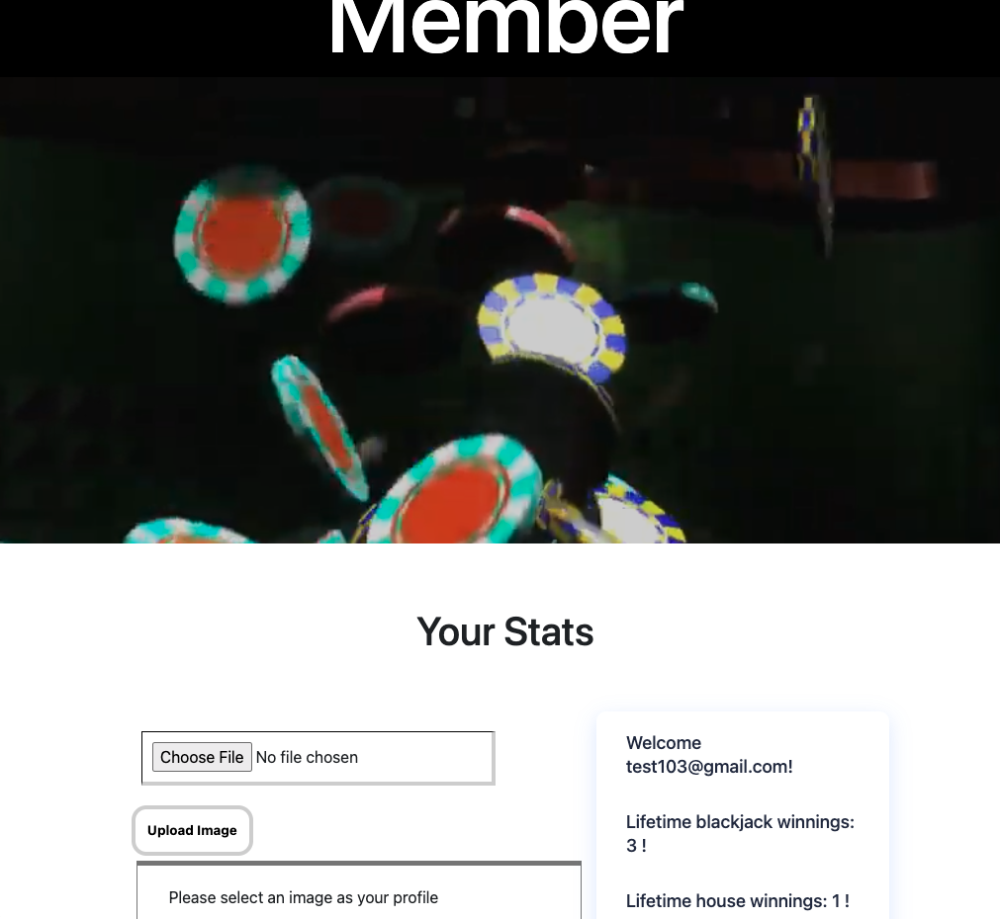

# social-underground-2.0

## Team Members
- Ryan Zelazny
- Brianna Hebeler
- Alexander (Zander) Portera
- Justin Rhee
- Yasmim Sampaio

## Description
Welcome to the Social Underground, a place where you can meet with friends and play some games in a virtual casino. This is an application built so that users do not need multiple windows open to play a game and chat. The user will be able to be able to hangout with their friends while playing a fun game of blackjack or rock paper scissors at one of our "tables".

## How to use

1) If you're a new player click sign up, if not just login using the information you provided during the sign up phase.

2) Go ahead and join a table

3) You can choose multiplayer for rock, paper, or scissor or single player for blackjack. Also if you notice on the bottom you have a chat box where you can talk to your friends.

4) Read the rules and press start

5) HAVE FUN!

6) Once you're done playing you can head over to the member tab and view your stats. There you can see how many times you won against the house we well as how many time the house won against you. Also on this page you're able to upload an image of yourself as your profile. 

##  Link
Heroku: 
https://social-underground-2.herokuapp.com/

Github:
https://github.com/rzelazny/social-underground-2.git